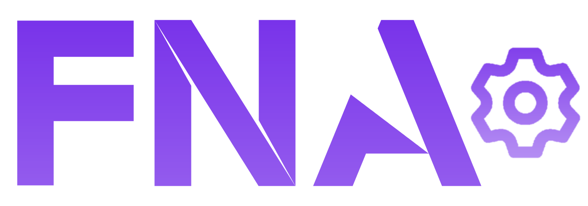

# QuickFNA
A quick FNA .Net Native project generator 


## Getting Started
### NOTE:
**This batch is intended to set up projects from 0, if you already have a project, you'll have to do everything by hand, this script won't help you**
### Prerequisites

* .Net 8.0 & .Net 7.0
* Python 3.6+
* Visual studio 2022
* CMake
* Git
### Windows Installation
1. Download both the .bat file and .py file inside any folder
2. Open a Developer Command Prompt for VS 2022
3. Navigate to the directory where you downloaded the previous files
4. Run ```run_this.bat ```
5. Enter your project name when required, do not use spaces when naming the project
6. Wait, open the project folder, run the solution and enjoy .Net Native 

### ArchLinux installation
1. Download all the files in the repo
2. run ```nano ~/.bash_profile```
3. add the line export ```LD_LIBRARY_PATH=$LD_LIBRARY_PATH:/usr/local/lib```, save and close
4. open the directory with the repo file
5. run ```sudo chmod +x setup_linux.sh```
6. run ```sudo ./setup_linux.sh```
7. Enter your project name when required, do not use spaces when naming the project
8. Wait, open the project folder, run the solution and enjoy .Net Native

I only have a setup script for Arch because if you're making a build for linux, it's gonna run on a Steam Deck lol. I personally used [ArchWSL](https://github.com/yuk7/ArchWSL.git) so I could go back and forth between Windows and linux build quickly. The actual compiled build are then sent to my Steam Deck for testing
